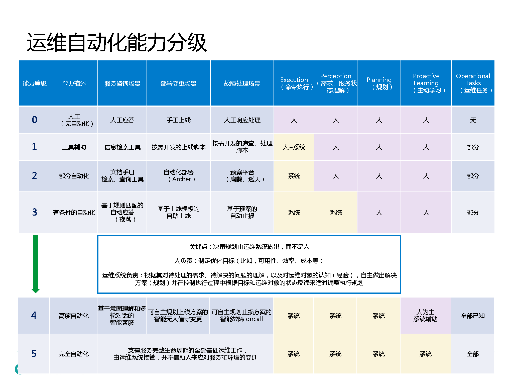
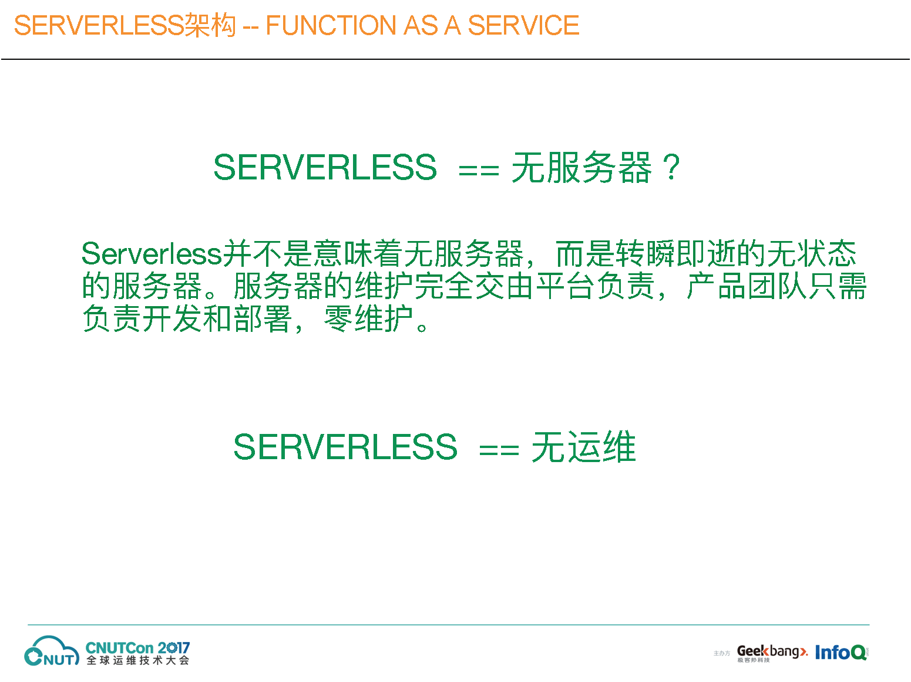
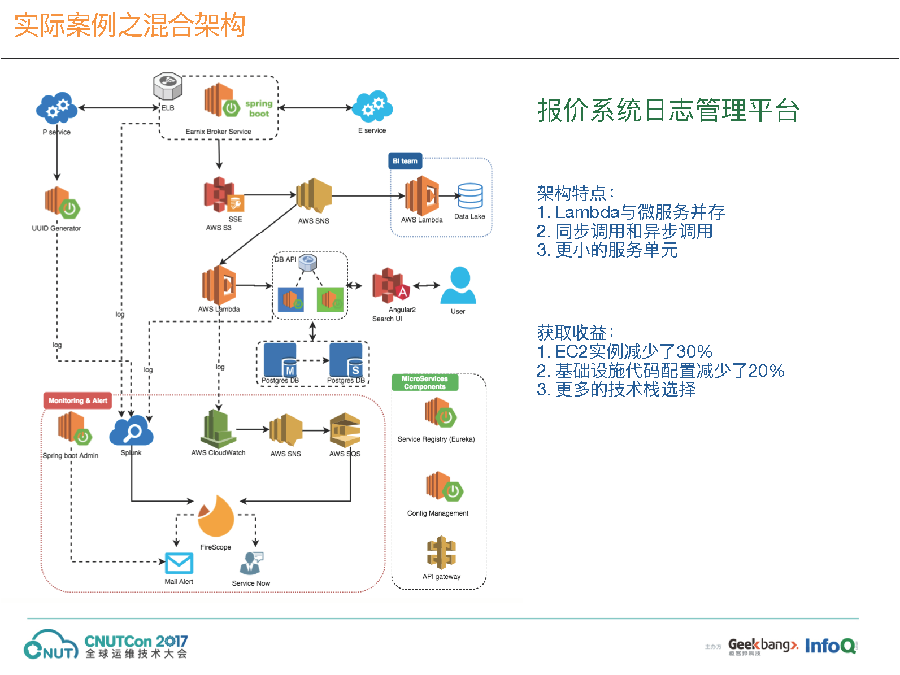
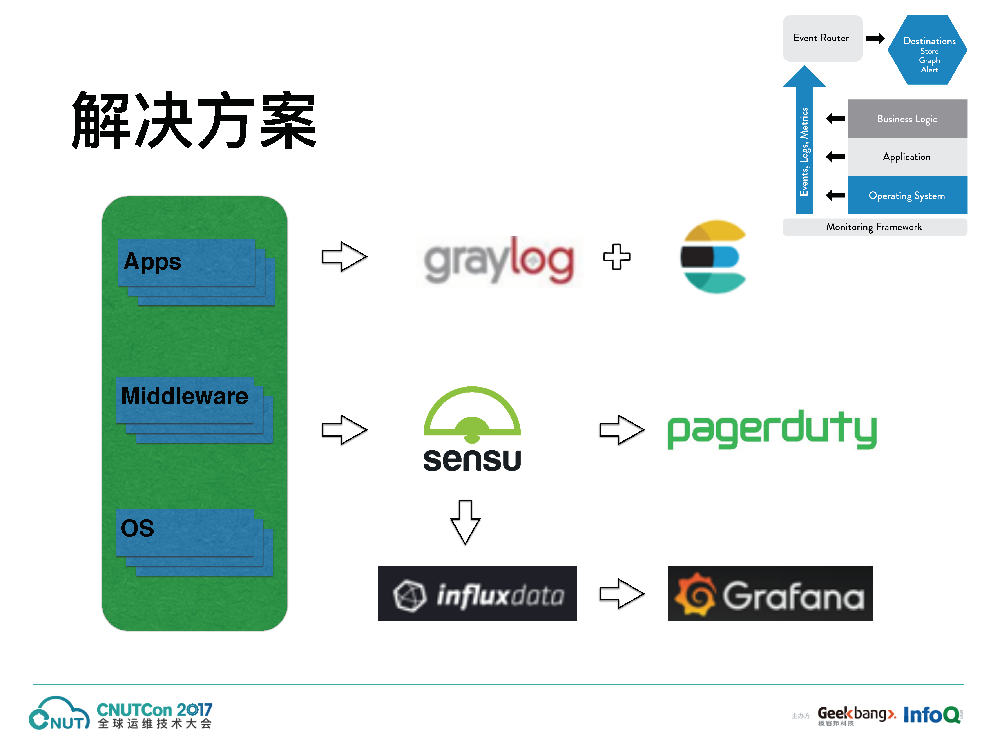

在今年的 9 月 10 至 11 日，有幸获得导师的邀请，参加了全球运维技术大会。
这篇博客记录了会上一些有意思的内容。
文章写的比较随意，主要是给自己看~(￣ ▽ ￣)~\*

<!-- more -->

## 开场

主持人介绍了运维的演变过程。

运维的演变：SA → Ops → DevOps → SRE

运维平台的演变：流程化 → 工具化 → Web 化 → 自动化 → 智能化

最后提了新运维下的热门技术：

- DevOps
- AIOps
- Serverless
- SRE
- 智能化运维
- 自动化运维

## 为什么说 AIOps 是未来，百度的思考与实践

百度做了一个运维自动化的能力分级，类似于 CMMI。

## 基于日志 trace 的智能故障定位系统

日志抽样的方式：

- 匀质抽样
- 异常抽样
- 人工抽样

## CNUTCon 夜聊：谈谈智能时代的新运维

阿里许晓斌讲师认为：需要智能化运维是因为应用程序不易运维。
他更关注 Cloud Native。
与其运维系统做的好，不如应用更好的去适应云。

## 微服务场景下的 Serverless 架构实践

什么是 Serverless：

Serverless 的优缺点以及未来：

日志管理平台：

## 天猫 DevOps 转型实践

天猫内部正在编写给新人的 DevOps 权威指南。
我们很希望能得到天猫的支持，但是很遗憾，文档仅供内部使用，并不开放。

## 基于虚拟化的 CI/CD 流程与基础架构建设

美团使用 Jenkins 作为 CI 服务器的原因：

- 开源，插件开发成本低。
- 社区活跃，技术成熟，培训成本低。
- 安全性。可以部署在私有系统上。

为什么要自研部署系统：

- 部署场景比较复杂，需要适应实际的业务需求，特别是关系到生产环境，现有的系统不合适。
- 而 Jenkins 作为 CI 系统满足了大部分需求，各个厂商都差不多。

## 全方位的监控与智能透明的自动化运维

一些日志工具：

其中 graylog 可以根据需求拉取特定日志。

ChatOps 可以方便移动运维。
IBM 有 70% 的时间在用 Chatbot。

[CNUTCon 2017 官网 →](http://www.cnutcon.com/)
